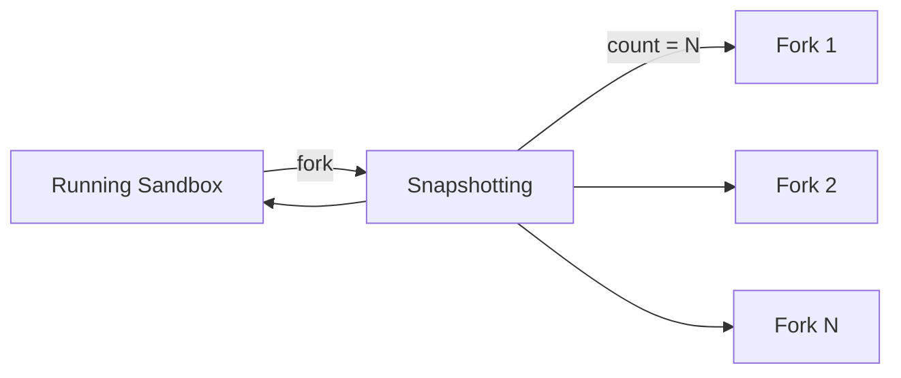

Forking lets you create running copies of a sandbox in a single call.
The sandbox is snapshotted in place — paused, captured with its full filesystem and memory state, and resumed — and new sandboxes boot from that snapshot.

Each fork is an independent sandbox with its own ID and timeout. It starts with the exact state the original had at the moment of the fork — files, running processes, loaded variables, and data — and diverges from there. The original sandbox keeps running with its ID and expiration untouched.

## Fork flow



The snapshot is captured once regardless of how many forks you request, so forking into many sandboxes costs the same single snapshot of the original.

<Warning>
During the fork, the original sandbox is paused and resumed. The pause duration scales with the amount of disk changes since the last snapshot — write-heavy workloads pause longer. The pause also causes all active connections (e.g. WebSocket, PTY, command streams) to be dropped, so make sure your client handles reconnection properly.
</Warning>

## Fork a sandbox

You can fork a running sandbox instance. The method returns a list with one entry per requested fork.

<CodeGroup>
```js JavaScript & TypeScript
import { Sandbox } from 'e2b'

const sandbox = await Sandbox.create()
await sandbox.files.write('/home/user/state.txt', 'shared state')

// Fork the sandbox
const [fork] = await sandbox.fork()
if (fork instanceof Sandbox) {
  // The fork starts with the original's files, processes, and memory
  await fork.commands.run('cat /home/user/state.txt')
}
```
```python Python
from e2b import Sandbox

sandbox = Sandbox.create()
sandbox.files.write('/home/user/state.txt', 'shared state')

# Fork the sandbox
fork, = sandbox.fork()
if isinstance(fork, Sandbox):
    # The fork starts with the original's files, processes, and memory
    fork.commands.run('cat /home/user/state.txt')
```
</CodeGroup>

You can also fork by sandbox ID using the static method.

<CodeGroup>
```js JavaScript & TypeScript
import { Sandbox } from 'e2b'

// Fork by sandbox ID
const forks = await Sandbox.fork(sandboxId)
```
```python Python
from e2b import Sandbox

# Fork by sandbox ID
forks = Sandbox.fork(sandbox_id)
```
</CodeGroup>

## Create multiple forks

Use `count` to boot several sandboxes from the same snapshot in one call. You can request up to 100 forks at once.

<CodeGroup>
```js JavaScript & TypeScript highlight={5}
import { Sandbox } from 'e2b'

const sandbox = await Sandbox.create()

const forks = await sandbox.fork({ count: 3 })

for (const fork of forks) {
  if (fork instanceof Sandbox) {
    console.log('Forked sandbox:', fork.sandboxId)
  }
}
```
```python Python highlight={5}
from e2b import Sandbox

sandbox = Sandbox.create()

forks = sandbox.fork(count=3)

for fork in forks:
    if isinstance(fork, Sandbox):
        print('Forked sandbox:', fork.sandbox_id)
```
</CodeGroup>

## Handle failed forks

Each fork succeeds or fails independently. Instead of throwing on the first failure, the returned list contains a connected sandbox for each fork that started and an error value for each fork that didn't — so a partial failure doesn't throw away the successful forks.

<CodeGroup>
```js JavaScript & TypeScript
import { Sandbox } from 'e2b'

const results = await sandbox.fork({ count: 5 })

const forks = results.filter((r) => r instanceof Sandbox)
const errors = results.filter((r) => !(r instanceof Sandbox))

for (const error of errors) {
  console.error('Fork failed:', error.message)
}
```
```python Python
from e2b import Sandbox

results = sandbox.fork(count=5)

forks = [r for r in results if isinstance(r, Sandbox)]
errors = [r for r in results if not isinstance(r, Sandbox)]

for error in errors:
    print('Fork failed:', error)
```
</CodeGroup>

If the request fails as a whole (for example, the sandbox does not exist), the method throws instead of returning error values.

## Fork timeout

The `timeoutMs` (JavaScript) / `timeout` (Python) option sets how long the new forked sandboxes live and defaults to 5 minutes, like `Sandbox.create()`. It applies to the forks only — the original sandbox's expiration is not changed.

<CodeGroup>
```js JavaScript & TypeScript
import { Sandbox } from 'e2b'

const forks = await sandbox.fork({ count: 2, timeoutMs: 60_000 }) // 60 seconds
```
```python Python
from e2b import Sandbox

forks = sandbox.fork(count=2, timeout=60) # 60 seconds
```
</CodeGroup>

## Forking vs. Snapshots

Forking is a one-call shortcut for the common snapshot pattern: capture a running sandbox and immediately boot new sandboxes from the capture.

| | Forking | Snapshots |
|---|---|---|
| Result | Running sandboxes, ready to use | A persistent snapshot ID |
| Reuse | Snapshot is used once, for this call's forks | Snapshot can spawn sandboxes any time later |
| Steps | One call | `createSnapshot()` / `create_snapshot()`, then `Sandbox.create()` per sandbox |

Use forking when you want running copies right now. Use [snapshots](/docs/sandbox/snapshots) when you want a durable checkpoint to create sandboxes from later.
